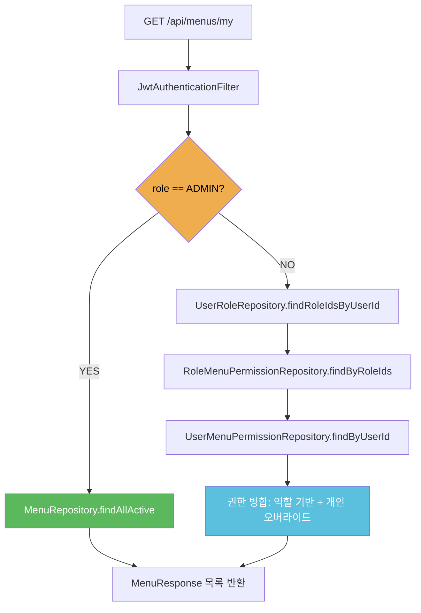

# RBAC 통합 아키텍처 패턴

**도메인:** Spring Boot WebFlux + R2DBC RBAC 통합
**분석일:** 2026-05-27
**신뢰도:** HIGH (기존 코드 직접 분석 + Context7 공식 문서 검증)

---

## 1. 권한 체크 위치 결정

### 결론: 3계층 분산 방식 (SecurityConfig + @PreAuthorize + 서비스)

단일 위치에 몰아넣으면 안 된다. 각 레이어가 담당해야 할 책임이 명확히 다르다.

| 체크 위치 | 담당 책임 | 적용 대상 |
|-----------|-----------|-----------|
| `SecurityConfig.authorizeExchange` | path 기반 인증 여부 + ADMIN role 판단 | `/api/v1/admin/**`, 공개 경로 |
| `@PreAuthorize("hasRole('ADMIN')")` | 메서드 수준 role 강제 | `GET /api/menus` (ADMIN 전용 디렉토리) |
| `MenuPermissionService` (서비스 레이어) | 메뉴별 READ/WRITE 권한 조회 로직 | `GET /api/menus/my` 응답 필터링 |

**JwtAuthenticationFilter에 메뉴 권한 체크를 넣으면 안 되는 이유:**
- 필터는 모든 요청에 실행된다. 메뉴 권한이 필요 없는 경로(actuator, auth, batch)에도 DB 조회가 발생한다.
- 필터가 권한 결과를 SecurityContext에 넣으려면 `GrantedAuthority` 목록으로 변환해야 하는데, 메뉴 권한은 구조적으로 `GrantedAuthority`에 맞지 않는다 (READ/WRITE × 메뉴ID 조합).
- 필터는 stateless JWT를 검증하는 용도다. 권한 로직을 섞으면 단일 책임이 깨진다.

**현재 JwtAuthenticationFilter 분석:**
```
토큰 파싱 → 블랙리스트 확인 → userId + role → Authentication 설정
```
이 흐름에 메뉴 조회를 끼워넣으면 안 된다. 필터는 그대로 유지한다.

---

## 2. 컴포넌트 경계

### 패키지 배치: `menu/` 신규 도메인

`account/`에 넣지 않고 `menu/` 신규 도메인을 만들어야 한다.

**account/에 넣으면 안 되는 이유:**
- 메뉴 권한은 계정(account) 도메인의 책임이 아니다. 계정 도메인은 인증(누가 로그인했는가)을 담당하고, 메뉴 도메인은 인가(무엇을 볼 수 있는가)를 담당한다.
- 이미 `account/` 패키지는 `Account`, `RefreshToken`, `SocialAccount` + 서비스 4개로 충분히 크다.
- `menu/` 도메인으로 분리하면 이후 메뉴 CRUD API 추가 시 account 도메인 건드리지 않아도 된다.

**단, `access/` 이름은 피한다.** "접근 제어"라는 의미가 너무 광범위하다. `menu/`가 실제로 다루는 것(메뉴 목록과 메뉴별 권한)을 정확히 표현한다.

```
api/src/main/java/com/example/bootstrap/
├── account/          (기존 유지)
├── ai/               (기존 유지)
├── batch/            (기존 유지)
├── menu/             (신규)
│   ├── controller/
│   │   └── MenuController.java       # GET /api/menus/my, GET /api/menus
│   ├── application/
│   │   ├── dto/
│   │   │   ├── MenuResponse.java     # 메뉴 응답 (id, code, name, sortOrder, canRead, canWrite)
│   │   │   └── MyMenusResponse.java  # 내 메뉴 목록 응답
│   │   └── service/
│   │       └── MenuService.java      # 권한 조회 + ADMIN 바이패스 로직
│   ├── domain/
│   │   ├── model/
│   │   │   ├── Menu.java
│   │   │   ├── Role.java
│   │   │   ├── UserRole.java
│   │   │   ├── RoleMenuPermission.java
│   │   │   └── UserMenuPermission.java
│   │   └── repository/
│   │       ├── MenuRepository.java
│   │       ├── RoleRepository.java
│   │       ├── UserRoleRepository.java
│   │       ├── RoleMenuPermissionRepository.java
│   │       └── UserMenuPermissionRepository.java
│   └── infrastructure/
│       └── (현재 불필요 — 외부 시스템 연동 없음)
└── global/           (기존 유지)
```

### 컴포넌트 책임 정의

| 컴포넌트 | 책임 | 의존 대상 |
|----------|------|-----------|
| `MenuController` | HTTP 수신, `@PreAuthorize` 적용, `MenuService` 위임 | `MenuService` |
| `MenuService` | ADMIN 바이패스 판단, 역할/사용자 권한 조회, 오버라이드 병합 | 5개 Repository |
| `MenuRepository` | `menus` 테이블 CRUD | R2DBC |
| `RoleMenuPermissionRepository` | `role_menu_permissions` 조회 | R2DBC |
| `UserMenuPermissionRepository` | `user_menu_permissions` 조회 (오버라이드) | R2DBC |
| `UserRoleRepository` | 사용자의 역할 목록 조회 | R2DBC |

---

## 3. 데이터 흐름

### `GET /api/menus/my` 흐름

이 API가 핵심이다. PROJECT.md에서 "사용자가 접근 가능한 메뉴 목록을 API로 정확히 내려주는 것"이 Core Value로 명시되어 있다.

```
HTTP GET /api/menus/my
  → JwtAuthenticationFilter (기존, 변경 없음)
      → Authentication { userId, role } → SecurityContext
  → MenuController.getMyMenus(@AuthenticationPrincipal Long userId)
  → MenuService.getAccessibleMenus(userId, role)
      ┌─ role == "ADMIN"?
      │    YES → MenuRepository.findAllActive() → 모든 메뉴 반환 (canRead=true, canWrite=true)
      │    NO  ↓
      ├─ UserRoleRepository.findRoleIdsByUserId(userId)          [쿼리 1]
      ├─ RoleMenuPermissionRepository.findByRoleIds(roleIds)     [쿼리 2]
      ├─ UserMenuPermissionRepository.findByUserId(userId)       [쿼리 3 - 오버라이드]
      └─ 권한 병합:
           역할 권한 먼저 적용 → 사용자 개별 오버라이드로 덮어쓰기
           → active 메뉴만 필터 → sortOrder 정렬
  ← Flux<MenuResponse> → ApiResponse<List<MenuResponse>>
```



### `GET /api/menus` (ADMIN 전용 디렉토리) 흐름

```
HTTP GET /api/menus
  → JwtAuthenticationFilter → SecurityContext
  → @PreAuthorize("hasRole('ADMIN')") → ADMIN 아니면 403 즉시 반환
  → MenuService.getAllMenus()
  → MenuRepository.findAll() [활성/비활성 모두 포함]
  ← Flux<MenuResponse>
```

---

## 4. R2DBC 복잡 조인 패턴

### R2DBC는 JOIN을 직접 지원하지 않는다 [HIGH]

Spring Data R2DBC는 JDBC/JPA와 달리 엔티티 간 관계(`@OneToMany` 등)를 자동으로 조인하지 않는다. 복잡한 조인 쿼리는 두 가지 방법 중 하나를 선택해야 한다.

**방법 A: `@Query` 어노테이션 (권장)**

단일 SQL로 필요한 데이터를 평탄화(flatten)해서 가져온다. 결과를 Java DTO에 매핑한다.

```java
// UserRoleRepository.java
public interface UserRoleRepository extends ReactiveCrudRepository<UserRole, Long> {

    @Query("SELECT role_id FROM user_roles WHERE user_id = :userId")
    Flux<Long> findRoleIdsByUserId(@Param("userId") Long userId);
}

// RoleMenuPermissionRepository.java
public interface RoleMenuPermissionRepository
        extends ReactiveCrudRepository<RoleMenuPermission, Long> {

    @Query("""
        SELECT rmp.menu_id, rmp.can_read, rmp.can_write
        FROM role_menu_permissions rmp
        WHERE rmp.role_id IN (:roleIds)
        """)
    Flux<RoleMenuPermission> findByRoleIds(@Param("roleIds") List<Long> roleIds);
}
```

**방법 B: `DatabaseClient` (복잡한 집계가 필요할 때)**

`R2dbcEntityTemplate` / `DatabaseClient`를 직접 사용해서 임의의 SQL과 결과 매핑 람다를 조합한다. 단순 조회에는 과하다. `@Query`로 해결 안 될 때만 꺼낸다.

**이 프로젝트에서는 방법 A로 충분하다.** 조인 깊이가 최대 2단계(user→roles→permissions)이고, 결과를 집계가 아닌 단순 목록으로 처리한다.

### 권한 병합 로직은 DB가 아닌 서비스에서 처리한다

역할 권한과 사용자 오버라이드 권한을 한 번의 SQL로 병합하려 하면 쿼리가 복잡해지고 R2DBC 매핑이 어렵다. 대신:

1. 쿼리 1: 역할별 메뉴 권한 (Flux)
2. 쿼리 2: 사용자 개별 오버라이드 (Flux)
3. Java에서 `Map<menuId, Permission>`으로 병합 (`Mono.zip` 또는 `flatMap` 체인)

```java
// MenuService.java 핵심 로직 스케치
public Flux<MenuResponse> getAccessibleMenus(Long userId, String role) {
    if ("ADMIN".equals(role)) {
        return menuRepository.findAllActive()
            .map(menu -> toResponse(menu, true, true));
    }

    Mono<List<Long>> roleIds = userRoleRepository
        .findRoleIdsByUserId(userId)
        .collectList();

    return roleIds.flatMapMany(ids ->
        Mono.zip(
            roleMenuPermissionRepository.findByRoleIds(ids).collectList(),
            userMenuPermissionRepository.findByUserId(userId).collectList(),
            menuRepository.findAllActive().collectList()
        ).flatMapMany(tuple -> {
            // 역할 권한 → Map<menuId, Permission>
            // 사용자 오버라이드로 덮어쓰기
            // 메뉴 목록과 조합하여 Flux<MenuResponse> 반환
            return Flux.fromIterable(mergePermissions(tuple));
        })
    );
}
```

---

## 5. SecurityConfig 통합 방식

`SecurityConfig`에 메뉴 경로를 추가한다. 기존 구조를 최소한으로 건드린다.

```java
.authorizeExchange(exchanges -> exchanges
    // ... 기존 규칙 유지 ...
    .pathMatchers(HttpMethod.GET, "/api/v1/menus/my").authenticated()  // USER/ADMIN 모두
    .pathMatchers(HttpMethod.GET, "/api/v1/menus").hasRole("ADMIN")    // ADMIN 전용
    .anyExchange().authenticated()
)
```

`GET /api/menus` ADMIN 체크는 `SecurityConfig`와 `@PreAuthorize` 중 하나만 사용한다. 양쪽 다 쓰면 중복이다. `SecurityConfig`의 path 매칭으로 처리하는 것이 명시적이고 한 곳에서 관리된다.

---

## 6. 빌드 순서

의존성 방향: DB 스키마 → 도메인 모델 → Repository → Service → Controller

```
1단계: DB 스키마 (V3__ 마이그레이션)
   - menus, roles, user_roles, role_menu_permissions, user_menu_permissions
   - 기존 users.role CHECK 제약 제거 (roles 테이블 추가 후 필요 시)
   verify: Flyway 실행 성공, psql로 테이블 존재 확인

2단계: 도메인 모델 (menu/domain/model/)
   - Menu, Role, UserRole, RoleMenuPermission, UserMenuPermission
   verify: 컴파일 성공, @Table 어노테이션 테이블명 일치

3단계: Repository 인터페이스 (menu/domain/repository/)
   - 단순 CRUD는 ReactiveCrudRepository 상속으로
   - userId → roleIds, roleIds → permissions 조회는 @Query 사용
   verify: 단위 테스트 (@DataR2dbcTest) 통과

4단계: MenuService (menu/application/service/)
   - ADMIN 바이패스 로직 먼저 구현
   - 일반 사용자 권한 조회 + 병합 로직
   verify: ADMIN 계정으로 호출 시 모든 메뉴 반환, USER 계정으로 호출 시 권한 있는 메뉴만

5단계: MenuController + DTO (menu/controller/, menu/application/dto/)
   - GET /api/v1/menus/my
   - GET /api/v1/menus (ADMIN)
   verify: curl 테스트, 통합 테스트

6단계: SecurityConfig 업데이트
   - 메뉴 경로 authorizeExchange 추가
   verify: 인증 없이 /api/v1/menus/my 호출 → 401, USER로 /api/v1/menus 호출 → 403
```

```
DB 스키마 → 도메인 모델 → Repository → Service → Controller → SecurityConfig
    ↑                                       ↑
    Flyway V3                        ADMIN 바이패스 먼저 검증
```

---

## 7. DB 스키마 설계

```sql
-- menus: 메뉴 정의 (flat 구조)
CREATE TABLE menus (
    id         BIGSERIAL    PRIMARY KEY,
    code       VARCHAR(100) NOT NULL UNIQUE,   -- 'DASHBOARD', 'USER_MGMT' 등
    name       VARCHAR(200) NOT NULL,
    sort_order INT          NOT NULL DEFAULT 0,
    is_active  BOOLEAN      NOT NULL DEFAULT TRUE,
    created_at TIMESTAMP    NOT NULL DEFAULT CURRENT_TIMESTAMP
);

-- roles: 커스텀 역할 (USER/ADMIN 외 확장)
CREATE TABLE roles (
    id          BIGSERIAL    PRIMARY KEY,
    code        VARCHAR(100) NOT NULL UNIQUE,  -- 'OPERATOR', 'VIEWER' 등
    description VARCHAR(500) NULL,
    created_at  TIMESTAMP    NOT NULL DEFAULT CURRENT_TIMESTAMP
);

-- user_roles: 사용자-역할 다대다
CREATE TABLE user_roles (
    user_id    BIGINT NOT NULL REFERENCES users(id) ON DELETE CASCADE,
    role_id    BIGINT NOT NULL REFERENCES roles(id) ON DELETE CASCADE,
    PRIMARY KEY (user_id, role_id)
);

-- role_menu_permissions: 역할별 메뉴 권한
CREATE TABLE role_menu_permissions (
    role_id    BIGINT  NOT NULL REFERENCES roles(id) ON DELETE CASCADE,
    menu_id    BIGINT  NOT NULL REFERENCES menus(id) ON DELETE CASCADE,
    can_read   BOOLEAN NOT NULL DEFAULT FALSE,
    can_write  BOOLEAN NOT NULL DEFAULT FALSE,
    PRIMARY KEY (role_id, menu_id)
);

-- user_menu_permissions: 사용자 개별 오버라이드
CREATE TABLE user_menu_permissions (
    user_id    BIGINT  NOT NULL REFERENCES users(id) ON DELETE CASCADE,
    menu_id    BIGINT  NOT NULL REFERENCES menus(id) ON DELETE CASCADE,
    can_read   BOOLEAN NOT NULL DEFAULT FALSE,
    can_write  BOOLEAN NOT NULL DEFAULT FALSE,
    PRIMARY KEY (user_id, menu_id)
);
```

**인덱스:**
```sql
CREATE INDEX idx_user_roles_user_id ON user_roles (user_id);
CREATE INDEX idx_rmp_role_id ON role_menu_permissions (role_id);
CREATE INDEX idx_ump_user_id ON user_menu_permissions (user_id);
```

---

## 8. 아키텍처 제약사항

**ADMIN 바이패스는 서비스 레이어에만 존재한다.**
`SecurityConfig`는 경로 수준 ADMIN 체크(특정 관리용 API)만 담당한다. "ADMIN이면 모든 메뉴 접근 허용"이라는 비즈니스 규칙은 `MenuService`에 있어야 한다. 필터나 SecurityConfig에 이 로직을 두면 나중에 비즈니스 규칙이 바뀔 때 보안 인프라 코드를 건드려야 한다.

**R2DBC `@Query`의 `IN` 절 파라미터는 `List<Long>` 타입으로 넘긴다.**
Spring Data R2DBC는 `IN (:roleIds)`에 컬렉션을 바인딩하는 것을 지원한다 [HIGH, Context7 확인]. 단, `roleIds`가 빈 리스트이면 일부 DB 드라이버에서 오류가 난다. `UserRole`이 없는 사용자(역할 미할당 USER)에 대해 빈 리스트 처리를 `MenuService`에서 명시적으로 분기해야 한다.

**Mono.zip vs flatMap 체인 선택:**
역할 권한 조회, 사용자 오버라이드 조회, 메뉴 전체 조회를 병렬로 실행하려면 `Mono.zip()`이 맞다. 순차 실행이 필요한 이유가 없다.

---

## 9. 안티패턴

### JwtAuthenticationFilter에 메뉴 권한 로딩

**무슨 일이 생기나:** 모든 HTTP 요청에 user→roles→permissions JOIN 쿼리가 실행된다. 인증 API (`/api/v1/auth/**`) 요청에도 권한 조회가 실행된다.

**왜 나쁜가:** 성능 비용이 요청 경로에 무관하게 항상 발생한다. 필터 책임 과부하.

**대신:** 권한이 필요한 `MenuController` 메서드에서 `MenuService`를 통해 on-demand로 조회.

### roles 테이블에 USER/ADMIN을 다시 저장

**무슨 일이 생기나:** `users.role = 'USER'`이면서 `roles` 테이블에도 USER 역할이 있는 경우, 어느 것이 진짜 권한 소스인지 모호해진다.

**왜 나쁜가:** `users.role`은 JWT 클레임에 직접 반영되는 인증용 필드다. `roles` 테이블은 메뉴 접근 제어용 확장 역할이다. 두 체계가 충돌하면 ADMIN 바이패스 로직도 어디서 확인해야 하는지 불명확해진다.

**대신:** `roles` 테이블에는 USER/ADMIN 이외의 커스텀 역할만 넣는다. ADMIN 판단은 `users.role`에서만 한다.

---

## 10. 로드맵 시사점

**빌드 순서가 로드맵 페이즈 구조를 결정한다:**

- **Phase 1 (기반):** Flyway V3 스키마 + 도메인 모델 + Repository. 이것이 없으면 나머지 모든 것이 막힌다.
- **Phase 2 (핵심 API):** MenuService (ADMIN 바이패스 + 권한 병합) + `GET /api/menus/my`. Core Value 직접 달성.
- **Phase 3 (관리 API):** `GET /api/menus` ADMIN 전용 전체 디렉토리. Phase 2 완료 후 단순 추가.

**Phase 1 전에 Flyway 테스트 환경을 별도로 검증해야 한다.** 기존 `V1__init.sql`에 `CHECK (role IN ('USER', 'ADMIN'))` 제약이 걸려 있다. V3에서 users.role에 새 값을 넣으려 할 경우 충돌한다. 단, 이번 요구사항(roles 테이블 분리)에서는 users.role을 건드리지 않으므로 제약 충돌은 없다. V3 작성 시 확인 필요.

**`@PreAuthorize`가 동작하려면 `@EnableReactiveMethodSecurity`가 필요하다.** `SecurityConfig.java`에 이미 선언되어 있으므로 추가 설정 없이 `@PreAuthorize`를 사용할 수 있다 [HIGH, 코드 직접 확인].

---

*Architecture analysis: 2026-05-27*
